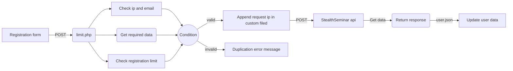

# Stealth Seminar API Registration limit

This project control how many times a user can register for a webinar using a email or a IP address or both. This api endpoint is works like a middleman. 
## Features

- Limit registration by email address
- Limit registration by IP address
- Client's IP in custom filed added automatically

## Required module
- CURL

## Usage
#### Add file to server
Make a new folder eg: webinar, then add these file inside. 
```
server_root
│    ...    
│
└─── webinar
    │   limit.php
    │   user.json
```
now your api endpoint is: `https://your-domain/webinar/limit.php`

#### Change url in your api form
Here I'm using form from [this project](https://github.com/abkarim/stealthseminar-api-registration-form). Just change submit url located in app.js.
```javascript
// ...
axios
    .post(`https://api.joinnow.live/webinars/${webinarShortId}/registration`, data, {
        contentType: 'application/json'
    })
// ...
```
**to** 
```javascript
// ...
axios
    .post(`https://your-domain/webinar/limit.php`, data, {
        contentType: 'application/json'
    })
// ...
```
#### Add webinar short id 
add your webinar short id in **limit.php**
```php
<?php
//...
$webinarShortId = ""; // Webinar short id
```

#### Enable/Disable email count
```php
<?php
//...
$validateWithEMail = true; // email duplication handling
```

#### Enable/Disable IP count
```php
<?php
//...
$validateWithIP = false; // IP address duplication handling
```

#### Change maximum registration count
```php
<?php
//...
$validateWithIP = false; // IP address duplication handling
```

#### Change maximum number of email duplication response
```php
<?php
// ...
echo json_encode([
                    "message" => "you are already registered in this event, please check your email!",
                ]); // Email matched message
// ...
```

#### Change maximum number of IP duplication response
```php
<?php
// ...
echo json_encode([
                    "message" => "you are already registered in this event, please check your email!",
                ]); // IP matched message
// ...
```

#### Change custom field name of ip_address
change ip_address to something else on both condition.
```php
<?php
// ...
# Add ip address to custom filed
if (isset($data->customFields)) {
    $data->customFields->ip_address = $ip;
} else {
    $data->customFields = [
        "ip_address" => $ip,
    ];
}
// ...
```

#### Clear users list 
When you want to clear users list or using with different webinar, replace **user.json** with this
```json
[]
```

### How does this project work

